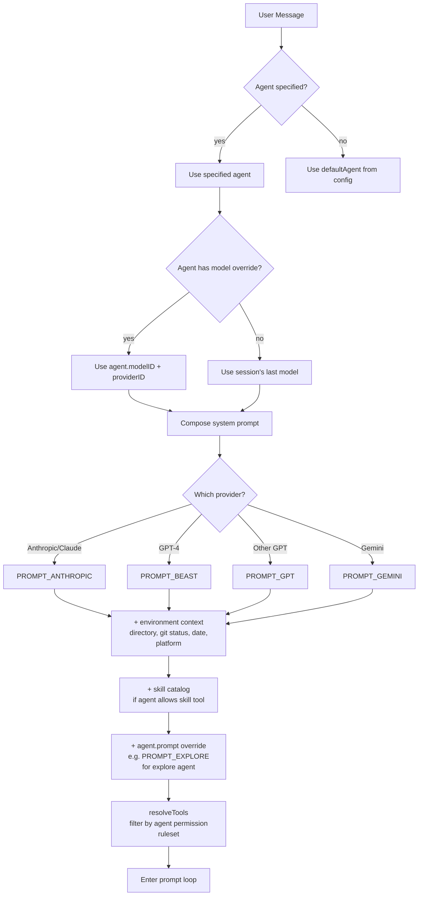
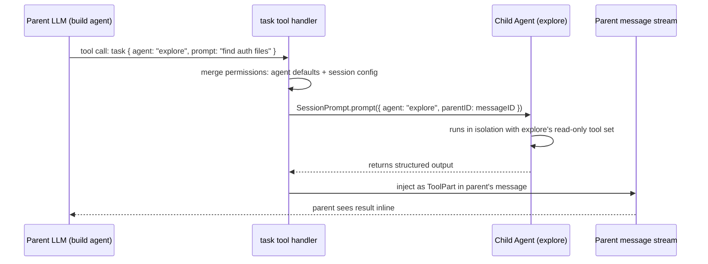
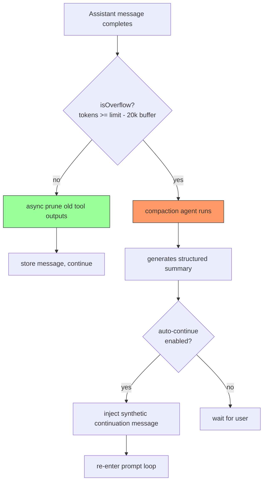
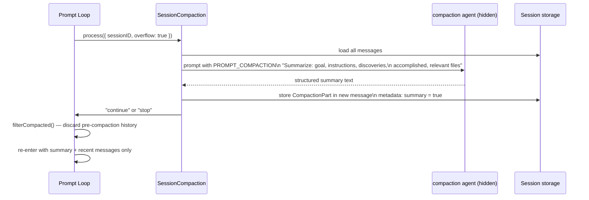
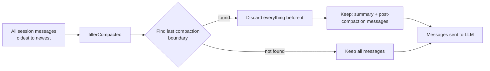
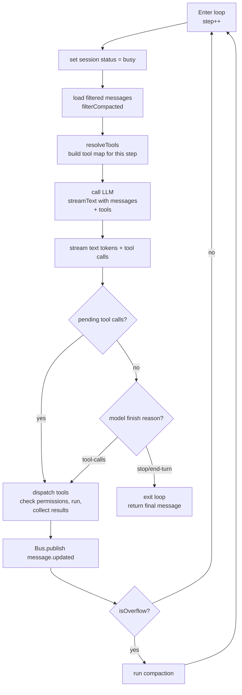
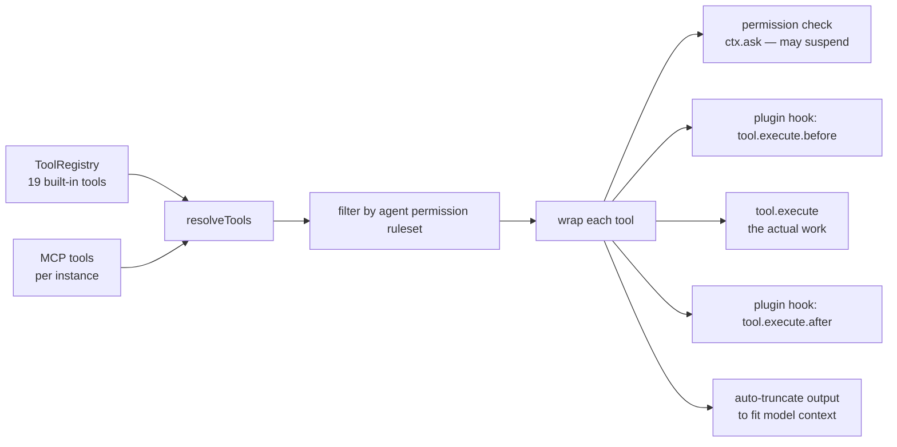
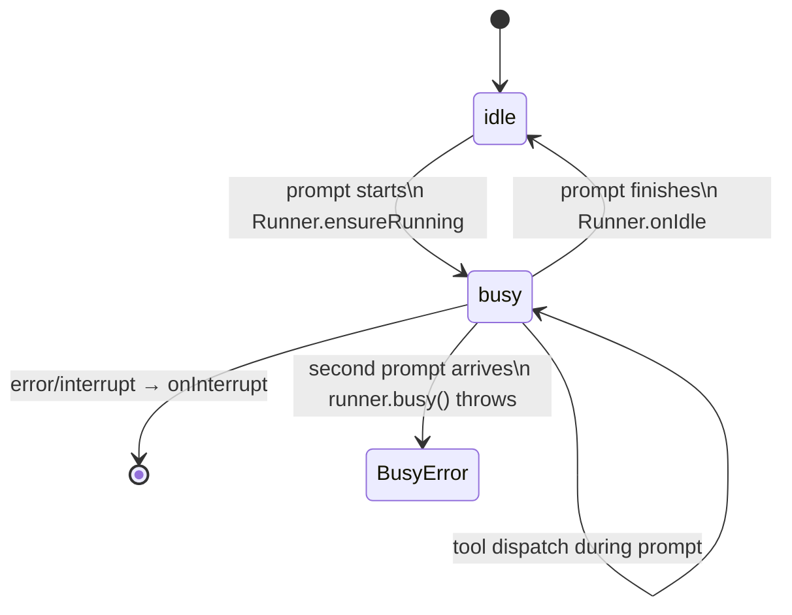

A single user message in opencode triggers more machinery than it appears. Agent selection reshapes the model, system prompt, and tool set. A multi-step loop runs until the model stops calling tools. When the conversation grows long enough, a hidden agent summarizes the history and the session replays — all transparent to the user.

---

## Part A: Agent Harnessing

### Agent Types

opencode defines agents as **personas**: named configurations that determine which model runs, what tools are available, what the system prompt says, and how aggressively the agent acts.

| Agent        | Mode             | Role                                                |
| ------------ | ---------------- | --------------------------------------------------- |
| `build`      | primary          | Default. Full tool access, can enter/exit plan mode |
| `plan`       | primary          | Read-only. Edit tools denied except plan files      |
| `general`    | subagent         | Multi-step parallel task executor; no TodoWrite     |
| `explore`    | subagent         | Fast codebase navigator; read-only tools only       |
| `compaction` | primary (hidden) | Summarizes conversation history                     |
| `title`      | primary (hidden) | Generates session titles; fixed temperature 0.5     |
| `summary`    | primary (hidden) | Summarizes file diffs and session outcomes          |

Hidden agents are never user-selectable — they're invoked internally by the system.

### Agent Selection Cascade

When a user sends a message, the agent is selected and the execution environment is fully configured from it:



The same `build` agent behaves differently when pointed at Claude vs GPT-4, because the base system prompt adapts to the model's strengths and known quirks. The `explore` agent uses `PROMPT_EXPLORE` — a custom prompt teaching parallel search strategies — layered on top.

### Subagent Sandboxing

`general` and `explore` are `mode: "subagent"` — they're not user-selectable. The parent LLM invokes them via the `task` tool:



The child agent runs a full independent prompt loop with its own permission ruleset. Its output is re-injected as a `ToolPart` in the parent's message stream. The parent sees it as a tool result and continues. Neither agent sees the other's internal state — clean separation with no shared mutable state.

The `explore` agent's tool allowlist: `grep`, `glob`, `list`, `bash` (read-only commands only via permission rules), `read`, `webfetch`, `websearch`, `codesearch`. No `edit`, no `write`, no `bash` for destructive operations.

---

## Part B: Session Memory

### The Context Overflow Problem

Language models have a finite context window. A long coding session — with tool outputs, file contents, diffs, and back-and-forth conversation — can easily exceed it. opencode uses three layers of defense:



### Layer 1: Async Pruning

After each session step, a background pass walks backwards through tool outputs. Once cumulative tool output exceeds `PRUNE_PROTECT` (40,000 tokens), older outputs are cleared:

```
Tool result (10k tokens) → compacted = Date.now()
Future prompts see: "[Old tool result content cleared]"
```

The model loses the verbatim output but retains the fact that the tool ran (the tool call and its metadata remain). This is safe for most tool types — the model can re-run a tool if it needs fresh data.

Protected from pruning: `skill` tool results (they contain instructions the model may still need).

### Layer 2: Compaction + Replay

When `isOverflow()` fires — input tokens plus output tokens plus cache tokens ≥ model limit minus a 20,000-token safety buffer — the `compaction` agent runs:



The compaction prompt template asks for: what was the overall goal, what instructions were given, what was discovered, what was accomplished, what files are relevant. The output becomes a `CompactionPart` stored in the session, marked `summary: true`.

### Layer 3: Message Filtering

Before every prompt iteration, `filterCompacted()` determines what actually gets sent to the model:



The logic: walk backwards through messages, find the most recent one where a compaction summary exists AND the immediately prior turn completed successfully. Everything before that point is discarded. The model receives: the summary, then whatever happened after.

A compaction part in the message stream becomes `"What did we do so far?"` when rendered for the LLM — the model naturally explains its context by reading the summary response.

---

## Part C: The Prompt Loop

### The Loop

The core of prompt execution is a `while(true)` loop that runs until the model signals completion with no pending tool calls:



The exit condition is deliberate: the loop only exits when `finish != "tool-calls"` AND there are no pending unexecuted tool calls. This handles models that signal `stop` before all tool results have been processed — the loop re-enters to give the model the remaining results.

### Tool Dispatch

`resolveTools()` builds the tool map before each LLM call. Each tool is wrapped with:



`ctx.ask()` is particularly interesting: it suspends the tool's Effect on a `Deferred` and publishes a `permission.asked` event to the Bus. The TUI receives this via SSE, shows a dialog, and the user's reply resolves the Deferred. The tool execution resumes — or fails with `RejectedError` if denied.

No polling, no timeouts, no callbacks. Effect's structured concurrency makes "suspend here until the user responds" a one-liner.

### Concurrent Prompt Protection

A session can only have one active prompt at a time:



`SessionRunState` maintains a `Runner` per session. If `runner.busy` is true and a new prompt arrives, it throws `BusyError` immediately — the HTTP 200 or 204 response already went out, so the error surfaces via Bus publish → SSE → TUI toast.

### Async Variant

Route handlers offer two prompt modes:

```
POST /session/:id/message     → waits for completion, returns final message
POST /session/:id/prompt_async → returns 204 immediately, fires and forgets
```

The async variant (`prompt_async`) is used by the TUI when a message is sent: return fast, let the SSE stream deliver progress. If it fails, the error is published as a `session.error` Bus event — the TUI shows it as a toast without blocking.
