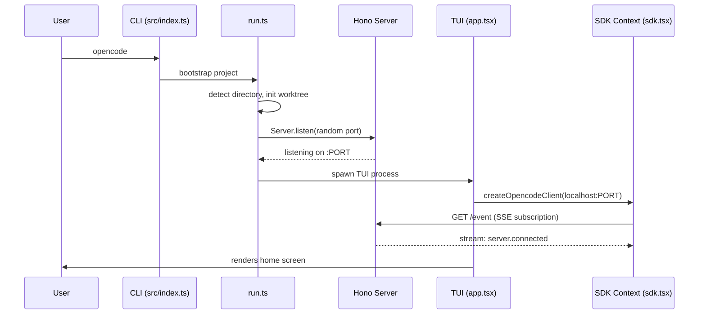
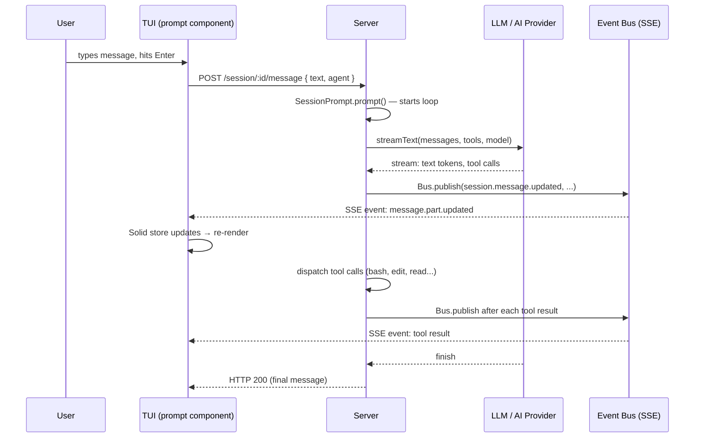
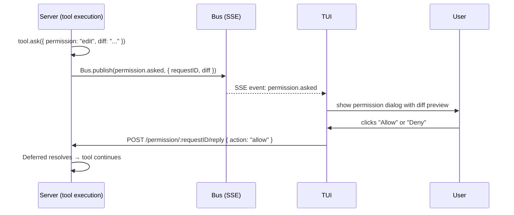
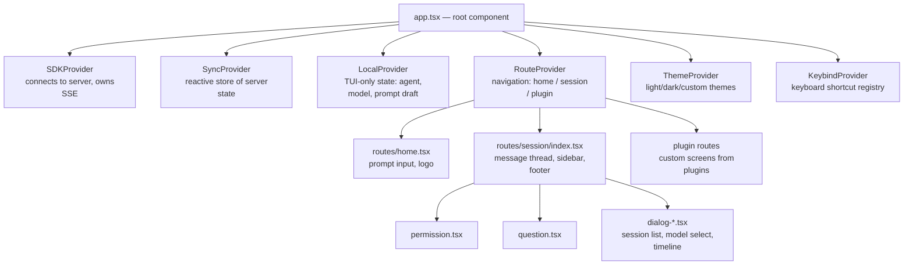
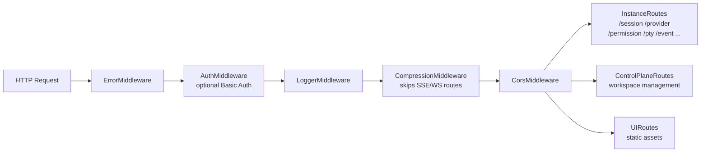
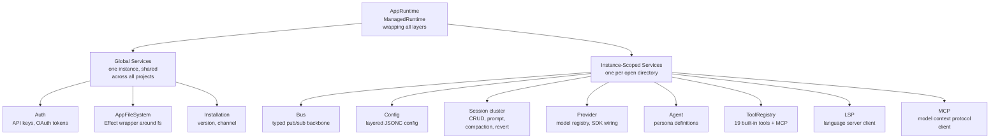

opencode ships as a single binary but runs as two cooperating processes: a local HTTP server and a terminal UI client. This separation is the foundational design decision that shapes everything else.

---

## What opencode Is

opencode is an AI coding agent that runs in your terminal. You give it a task — "fix this bug", "refactor this module" — and it uses language models to write code, run commands, and edit files, asking for permission before doing anything irreversible.

It is fully open-source, self-hosted (models run through your own API keys), and extensible via a plugin system.

---

## The Monorepo

The codebase is a Bun workspace with these primary packages:

| Package             | Role                                                   |
| ------------------- | ------------------------------------------------------ |
| `packages/opencode` | Core server, TUI client, and CLI — the main package    |
| `packages/sdk`      | JavaScript SDK for building clients against the server |
| `packages/plugin`   | Plugin system SDK (`@opencode-ai/plugin`)              |
| `packages/console`  | Admin web console (Solid.js) for opencode.ai           |
| `packages/desktop`  | Native desktop app wrapper                             |
| `packages/shared`   | Shared utilities (FileSystem, npm helpers)             |

Everything interesting lives in `packages/opencode`.

---

## The Client/Server Split

The most important architectural decision: **the TUI is a client**.

When you run `opencode`, it starts a local HTTP server on a random port, then launches the terminal UI as a separate process that connects to it via HTTP and Server-Sent Events (SSE).

```
┌─────────────────┐        HTTP + SSE        ┌──────────────────────┐
│   TUI Client    │ ◄────────────────────── │   opencode Server     │
│  (SolidJS +     │ ──POST /session/prompt─► │   (Hono + Effect)     │
│   OpenTUI)      │                          │   localhost:RANDOM    │
└─────────────────┘                          └──────────────────────┘
```

Why? Several reasons:

- The same server can power the TUI, a desktop app (Tauri/Electron), or a remote browser client
- You can run the server headless on a remote machine and connect the TUI from your laptop
- Multiple clients can observe the same session simultaneously

---

## Tech Stack

| Layer          | Technology              | Why                                                                               |
| -------------- | ----------------------- | --------------------------------------------------------------------------------- |
| TUI rendering  | OpenTUI + SolidJS       | Fine-grained reactivity without VDOM; handles 60 FPS terminal updates efficiently |
| HTTP server    | Hono                    | Fast, lightweight, excellent TypeScript support                                   |
| Async/services | Effect (v4)             | Composable async, typed errors, structured concurrency                            |
| Database       | SQLite + Drizzle ORM    | Embedded, zero-config, works offline                                              |
| AI integration | Vercel AI SDK           | Unified interface over 20+ model providers                                        |
| Runtime        | Bun (primary) / Node.js | Bun for speed; Node.js adapter for compatibility                                  |

---

## Startup Flow

When the user runs `opencode`:



The server and TUI share the same process via a single binary — the "spawn" is logical, not a separate OS process. The TUI renders inside the same Bun process using OpenTUI's synchronous renderer.

---

## Sending a Message: End-to-End Flow

The most important user flow:



The TUI never polls. All updates arrive via the SSE stream — the server pushes state as events.

---

## Permission Flow

When a tool needs user approval (e.g., editing a file):



The tool's Effect is suspended on a `Deferred` while waiting for the reply. No polling, no timeout machinery — Effect's structured concurrency handles it.

---

## TUI Architecture

The TUI is built with SolidJS running inside OpenTUI, a terminal UI framework that speaks SolidJS's reactivity model.



Key design: context providers own all state. Components read from providers via SolidJS signals — when the server pushes an event, `SyncProvider` updates its store, and all dependent components re-render automatically.

---

## Server Architecture

Inside the server, Hono middleware wraps all routes:



All business logic runs through `AppRuntime.runPromise(Effect.gen(...))` — a single composed Effect that yields all the services it needs.

---

## Service Layer at a Glance

The server manages ~50 services in two scopes:



Instance-scoped means: open two projects, get two independent Bus instances, two Config instances, two Session stores. They don't share state.

---

## Why This Architecture Works

The client/server split looks like added complexity, but it pays off in several ways:

1. **Multiple clients**: the desktop app reuses the same server — no duplicate logic
2. **Remote operation**: run the server on a devcontainer, connect TUI from your laptop
3. **Clean separation**: the TUI is a thin reactive client; all AI logic lives in the server
4. **SSE simplicity**: streaming AI output over SSE is simpler and more reliable than WebSockets for this use case — it's unidirectional by nature
