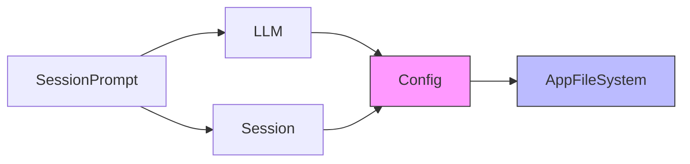
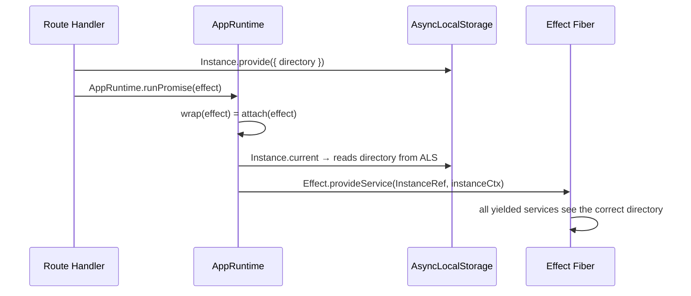

Most server applications use a dependency injection framework: NestJS decorators, InversifyJS containers, or manual factory wiring. opencode uses Effect's layer system instead — and the result is a service graph that is type-checked at compile time, deduplicated at runtime, and zero-config for developers.

---

## The Problem

opencode has ~50 services: `Session`, `Provider`, `Agent`, `Bus`, `Config`, `LSP`, `MCP`, `Permission`, `ToolRegistry`, and more. These have non-trivial dependencies:

- `SessionPrompt` needs `Session`, `Agent`, `LLM`, `Bus`, `Permission`, `ToolRegistry`
- `LLM` needs `Auth`, `Config`, `Provider`, `Plugin`
- `Config` needs `AppFileSystem`, `Bus`, `Npm`

Managing initialization order, ensuring nothing is constructed twice, and threading context through async call stacks — this is exactly what DI frameworks exist to solve. But DI frameworks add runtime overhead, require decorators or configuration files, and often lose type safety at the boundary.

Effect's layer system solves the same problem with TypeScript's type checker doing all the work.

---

## How Effect Layers Work

An Effect `Layer` is a description of how to build a service — including its dependencies. When you compose layers, Effect figures out the initialization order. If two services depend on `Config`, `Config` is built once and shared automatically.

The entire opencode service graph is expressed as:

```typescript
AppLayer = Layer.mergeAll(
  AppFileSystem, Bus, Auth, Account, Config, Git,
  Storage, Snapshot, Plugin, Provider, Agent, Skill,
  Session, SessionPrompt, SessionCompaction, ...,
  Permission, ToolRegistry, LSP, MCP, Format,
  Project, Vcs, Worktree, Pty, ...
).pipe(Layer.provideMerge(Observability.layer))

AppRuntime = ManagedRuntime.make(AppLayer, { memoMap })
```

`Layer.mergeAll` lists every service. `ManagedRuntime.make` builds and manages the lifecycle of the whole graph. That's the entire wiring — no config file, no container, no annotations.

---

## The MemoMap Trick



If `SessionPrompt` and `LLM` both depend on `Config`, and `AppLayer` lists them all, does `Config` get initialized twice?

No. The `memoMap` handles this:

```typescript
memoMap = Layer.makeMemoMapUnsafe();
// Shared across all runtimes in the process
// When Config.defaultLayer is encountered a second time,
// the memoMap returns the already-constructed instance
```

`Layer.makeMemoMapUnsafe()` creates a global memoization map. The first time a layer is constructed, the result is cached. Every subsequent request for the same layer returns the cached instance. This works even across multiple `ManagedRuntime` instances — they all share the same memoMap.

---

## Standard Service Shape

Every service in opencode follows this exact pattern (from `CLAUDE.md`):

```typescript
// src/foo/foo.ts

export interface Interface {
  readonly get: (id: FooID) => Effect.Effect<Foo, NotFoundError>;
  readonly create: (input: CreateInput) => Effect.Effect<Foo>;
}

export class Service extends Context.Service<Service, Interface>()(
  "@opencode/Foo",
) {}

export const layer: Layer.Layer<Service, never, Config.Service | Bus.Service> =
  Layer.effect(
    Service,
    Effect.gen(function* () {
      const config = yield* Config.Service;
      const bus = yield* Bus.Service;

      const get = Effect.fn("Foo.get")(function* (id) {
        // ...implementation
      });

      const create = Effect.fn("Foo.create")(function* (input) {
        // ...implementation
      });

      return Service.of({ get, create });
    }),
  );

export const defaultLayer = layer.pipe(
  Layer.provide(Config.defaultLayer),
  Layer.provide(Bus.defaultLayer),
);

export * as Foo from "./foo";
```

Three things worth noting:

**`Effect.fn("Foo.get")`** — every public method is named with `Effect.fn`. This name becomes a span in distributed traces when OpenTelemetry is enabled via `OTEL_EXPORTER_OTLP_ENDPOINT`. You get function-level tracing for free across the entire service graph.

**`defaultLayer`** — wires in all dependencies. Callers can use `Foo.defaultLayer` without knowing about `Foo`'s transitive dependencies.

**`Context.Service`** — the service tag is a string (`"@opencode/Foo"`) that uniquely identifies it in the Effect context. TypeScript's type system ensures you can't accidentally inject `Foo` where `Bar` is expected.

---

## The AppRuntime Call Pattern

Route handlers don't construct services. They yield them from the already-running AppRuntime:

```typescript
// Route handler — src/server/instance/session.ts
async (c) => {
  const sessionID = c.req.valid("param").sessionID;
  const body = c.req.valid("json");

  const result = await AppRuntime.runPromise(
    Effect.gen(function* () {
      const session = yield* Session.Service;
      const prompt = yield* SessionPrompt.Service;
      // both services are already built — just yield them
      return yield* prompt.prompt({ sessionID, ...body });
    }),
  );

  return c.json(result);
};
```

Compare this to the old facade pattern that's being removed:

```typescript
// Old pattern (being removed) — creates a separate runtime per call
const result = await SessionPrompt.prompt({ sessionID, ...body });
// ^ This hides an async facade backed by makeRuntime()
//   Two calls can end up with different runtime instances
```

The new pattern is explicit: one runtime, one Effect, all services composed inside it.

---

## Transparent Context Injection

Every effect run through `AppRuntime` automatically gets the current instance context (the project directory) injected. Developers never pass `directory` through call stacks manually.



The `attach()` function captures the current `AsyncLocalStorage` value and injects it as an Effect context service. This happens transparently on every `AppRuntime.runPromise()` call — no boilerplate in route handlers or services.

---

## Why It Works

Effect's layer system turns a hard runtime problem (service graph, initialization order, deduplication) into a compile-time problem. The TypeScript compiler verifies that every dependency is satisfied. The memoMap ensures no double construction. The `Effect.fn` naming gives distributed tracing for free.

The result: adding a new service to opencode requires writing the service file, adding one line to `AppLayer`, and using it via `yield* Foo.Service`. No registration, no configuration, no runtime surprises.
