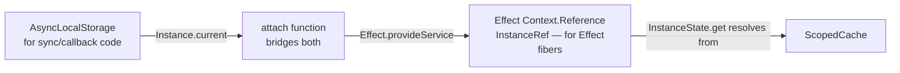
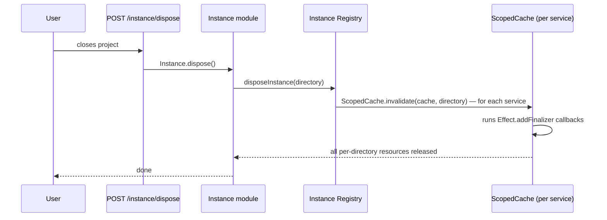

When you have five projects open simultaneously in opencode, each needs its own session history, its own config, its own LSP server, its own MCP connection, its own event bus. How do you achieve this in a single server process without leaking state between projects?

---

## The Problem

The naive solutions are both bad:

**Global singletons** — one `Session` service, one `Config` service, one `Bus`. Simple, but project A's config leaks into project B's requests. Session history gets mixed. The LSP for project A's Go code gets queries from project B's TypeScript.

**Separate processes per project** — each directory spawns its own server. Clean isolation, but expensive. Shared resources (auth tokens, provider connections, npm installations) get duplicated. Communication between projects becomes IPC.

opencode uses a third approach: **per-directory scoped caching inside a single process**.

---

## InstanceState: The Mechanism

Every instance-scoped service uses `InstanceState<A>` — a wrapper around Effect's `ScopedCache` keyed by project directory.

```mermaid
graph TD
    svc[Service Layer\n e.g. Bus.layer]
    is[InstanceState.make init ]
    sc[ScopedCache\n key: directory string]
    d1[/project/alpha → BusState\n own PubSub, own subscriptions]
    d2[/project/beta → BusState\n own PubSub, own subscriptions]
    d3[/project/gamma → BusState\n lazy, not yet initialized]

    svc --> is
    is --> sc
    sc --> d1
    sc --> d2
    sc --> d3
```

The pattern, in pseudocode:

```typescript
// Inside a service layer
const state =
  yield *
  InstanceState.make(
    Effect.fn("Bus.state")(function* (ctx) {
      // ctx.directory is the project root
      // This runs exactly once per directory, lazily on first access
      const pubsub = yield* PubSub.unbounded();
      yield* Effect.addFinalizer(() => PubSub.shutdown(pubsub));
      return { pubsub, subscribers: new Map() };
    }),
  );

// Inside a service method
const get = Effect.fn("Bus.get")(function* () {
  const s = yield* InstanceState.get(state);
  // s is the BusState for the CURRENT directory — resolved implicitly
  return s.pubsub;
});
```

`InstanceState.get(state)` resolves to the cached state for whatever directory the current Effect fiber is running in. The directory is not passed explicitly — it's threaded through context automatically.

---

## The Two-Layer Context Bridge

How does an Effect fiber know which directory it's in? There are two mechanisms that need to cooperate:



**AsyncLocalStorage (ALS)** is used for code that can't be Effect — native addon callbacks, legacy sync code. When a route handler runs `Instance.provide({ directory })`, all sync code in that call stack sees the correct directory via ALS.

**`InstanceRef`** is an Effect `Context.Reference` — a typed slot in the Effect fiber context. It holds the same `InstanceContext`.

**`attach()`** bridges them: before running any effect, `AppRuntime.runPromise` calls `attach(effect)`, which reads the current ALS value and injects it into the Effect context via `Effect.provideService`. The two systems stay in sync automatically.

---

## Native Addon Callbacks

Node.js native addons (file watchers, PTY, tree-sitter parsers) fire callbacks outside the Effect fiber. When `@parcel/watcher` detects a file change, its callback has no Effect context — and no ALS context either, because ALS doesn't propagate across native boundaries.

`Instance.bind` solves this:

```typescript
// When registering a file watcher
const watcher = await subscribe(
  directory,
  Instance.bind((events) => {
    // Instance.bind captures the current ALS context at bind time
    // When this callback fires (in a native thread), ALS is restored
    // so Instance.current works correctly
    AppRuntime.runPromise(
      Effect.gen(function* () {
        const bus = yield* Bus.Service;
        yield* bus.publish(File.Event.Changed, { events });
      }),
    );
  }),
);
```

`Instance.bind(fn)` captures the current ALS context at the moment of binding. When the native callback fires — potentially on a different thread, definitely outside any async chain — the bound function restores ALS before calling `fn`. This means `Instance.current` works correctly inside the callback, which means `InstanceState.get` resolves to the right directory.

---

## Instance Lifecycle and Cleanup

When a user closes a project, opencode disposes the instance:



The key: when `InstanceState.make` is called during service initialization, it registers a disposer with the instance registry:

```typescript
const off = registerDisposer((directory) =>
  Effect.runPromise(ScopedCache.invalidate(cache, directory)),
);
yield * Effect.addFinalizer(() => Effect.sync(off));
```

When the instance is disposed, the registry calls every registered disposer with the directory. `ScopedCache.invalidate` triggers the finalizers that were set up inside `InstanceState.make` — shutting down PubSubs, closing file watchers, terminating LSP servers, etc.

No service needs to know about the disposal lifecycle explicitly. The `Effect.addFinalizer` call inside `InstanceState.make` is all that's needed.

---

## Global vs Instance-Scoped

Not everything is per-directory. Some services are truly global:

| Service         | Scope    | Why                                        |
| --------------- | -------- | ------------------------------------------ |
| `Auth`          | Global   | API keys are per-user, not per-project     |
| `AppFileSystem` | Global   | Stateless wrapper — no per-directory state |
| `Installation`  | Global   | Version/channel is process-wide            |
| `Bus`           | Instance | Each project has its own pub/sub backbone  |
| `Config`        | Instance | Each project has its own `opencode.json`   |
| `Session`       | Instance | Sessions are per-project                   |
| `LSP`           | Instance | Each project runs its own language server  |
| `MCP`           | Instance | MCP connections are per-project            |
| `Provider`      | Instance | Model selection can vary by project config |

Global services use `makeRuntime(Service, layer)` from `src/effect/run-service.ts` — a lazy singleton that constructs one runtime on first use and shares it globally.

---

## Why It Works

The elegance is in what developers don't have to do. A service author writes:

```typescript
const s = yield * InstanceState.get(state);
```

They don't pass `directory`. They don't look up a `Map<string, State>`. They don't worry about initialization races. The `ScopedCache` handles deduplication (if two concurrent requests trigger `get` for the same directory, `init` runs once), and Effect's structured concurrency handles cleanup.

Five projects open simultaneously means five independent state trees, all managed by the same process, with automatic cleanup when any one closes.
