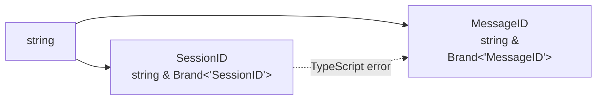
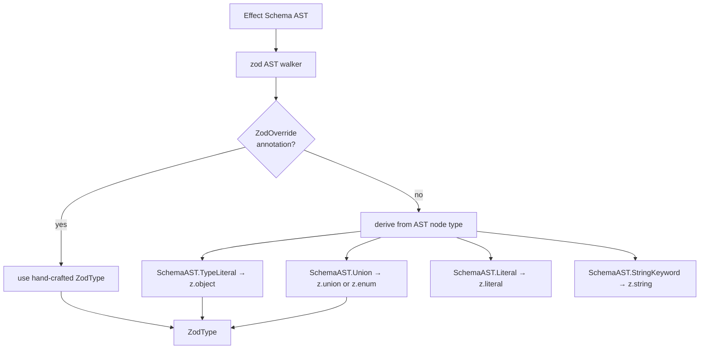
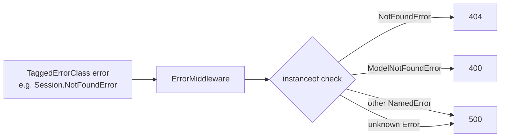
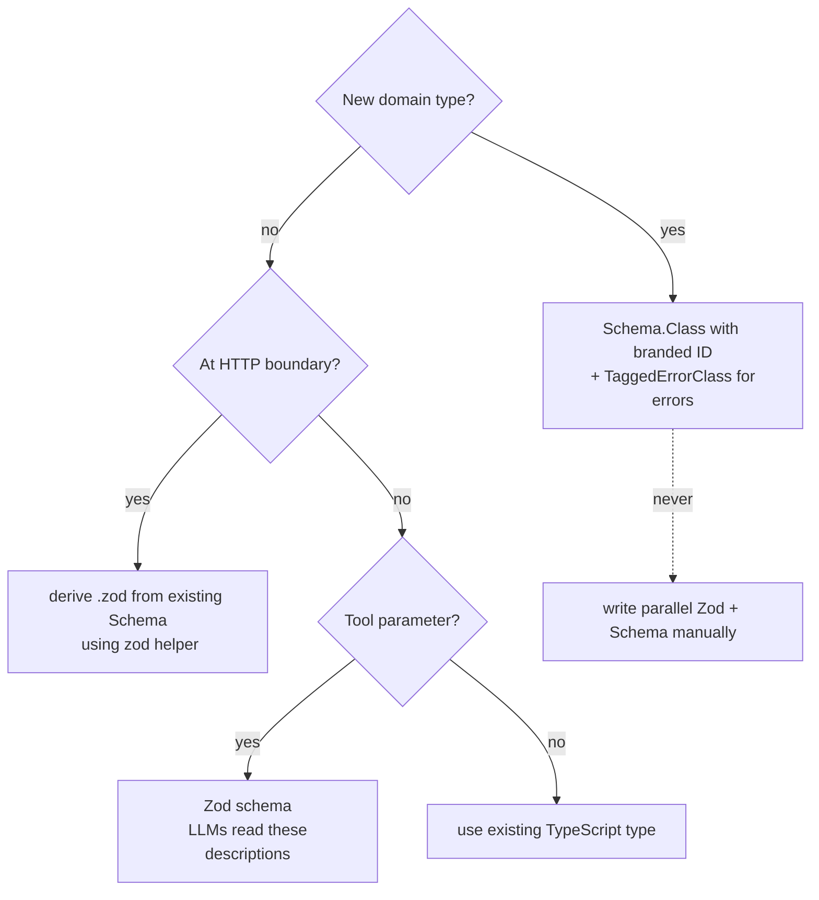

opencode has 19 tools, ~50 services, and a full REST API with OpenAPI documentation. In a typical TypeScript project, that's three separate definitions for every domain type: a TypeScript interface, a Zod schema for HTTP validation, and an OpenAPI schema for documentation. They drift apart. Bugs happen at boundaries.

opencode writes one schema and derives everything from it.

---

## The Problem

Consider a `Session` object. In a typical project you'd write:

```typescript
// TypeScript interface (for type checking)
interface Session { id: string; createdAt: number; ... }

// Zod schema (for HTTP validation)
const SessionZod = z.object({ id: z.string(), createdAt: z.number(), ... })

// OpenAPI spec (for documentation)
"Session": { type: "object", properties: { id: { type: "string" }, ... } }
```

Three definitions. When you add a field, you update one and forget the others. When a field's type changes from `string` to `number`, you find the bug at runtime. This problem multiplies across 50 domain types.

---

## Effect Schema as Source of Truth

opencode uses Effect Schema as the single source of truth. Effect Schema produces the TypeScript type, the runtime validator/encoder, and a reflectable AST — from one definition.

```typescript
// src/session/session.ts — simplified

export class Info extends Schema.Class<Info>("Session.Info")({
  id: SessionID, // branded type
  title: Schema.String,
  createdAt: Schema.Number,
  status: Schema.Literal("idle", "busy", "error"),
}) {
  static readonly zod = zod(Info); // derived — not hand-written
}
```

From this one definition:

- `Info` is the TypeScript type (inferred by the compiler)
- `Schema.decodeUnknown(Info)` validates and parses incoming data at runtime
- `Info.zod` is a Zod schema — derived automatically from the Effect Schema AST
- Hono's `hono-openapi` can reflect the Zod schema into OpenAPI components

---

## Branded IDs: Nominal Typing in TypeScript

TypeScript's structural type system means `type SessionID = string` and `type MessageID = string` are identical — you can pass one where the other is expected and the compiler won't complain.

opencode uses `Schema.brand` to create nominal types:

```typescript
// src/session/schema.ts
export const SessionID = Schema.String.pipe(Schema.brand("SessionID"));
export type SessionID = typeof SessionID.Type; // string & Brand<"SessionID">

export const MessageID = Schema.String.pipe(Schema.brand("MessageID"));
export type MessageID = typeof MessageID.Type; // string & Brand<"MessageID">
```

Now `SessionID` and `MessageID` are structurally incompatible. Passing a `MessageID` where a `SessionID` is expected is a compile error. This eliminates an entire class of "wrong ID type" bugs — the kind that only surface at runtime when the database returns no results.



---

## The `.zod` Shim: Deriving Zod from Effect Schema

HTTP route handlers and tool definitions need Zod schemas (for `validator()` middleware and `z.infer<>`). Rather than write them by hand, opencode derives them automatically.

The `zod()` function in `src/util/effect-zod.ts` walks Effect Schema's AST:



The string union optimization is worth noting: when every member of a union is a string literal, the walker emits `z.enum(["idle", "busy", "error"])` instead of `z.union([z.literal("idle"), z.literal("busy"), z.literal("error")])`. The difference matters for OpenAPI: `z.enum` produces `{ "enum": ["idle", "busy", "error"] }` — clean and readable. The union form produces a deeply nested `anyOf` structure.

The `ZodOverride` annotation gives escape hatches: branded ID schemas annotate their Zod override to use `z.custom<SessionID>()` with identifier validation, because the AST walker can't know the ULID format constraint.

---

## `withStatics`: Attaching Factories to Schemas

The `withStatics` utility in `src/util/schema.ts` attaches static methods to an Effect Schema object:

```typescript
export const SessionID = Schema.String.annotate({
  [ZodOverride]: Identifier.schema("session"),
}).pipe(
  Schema.brand("SessionID"),
  withStatics((s) => ({
    descending: (id?: string) => s.make(Identifier.descending("session", id)),
    zod: Identifier.schema("session").pipe(z.custom<typeof s.Type>()),
  })),
);
```

Now `SessionID` is both an Effect Schema and an object with:

- `SessionID.make("01J...")` — constructs a branded ID (runtime validation)
- `SessionID.descending(id?)` — generates a new descending ULID for ordered insertion
- `SessionID.zod` — the Zod schema for HTTP route params

All three derived from one definition. When you change the ID format, you change it in one place.

---

## TaggedErrorClass: Typed Domain Errors

opencode models every domain error with `Schema.TaggedErrorClass`:

```typescript
// src/session/session.ts
export class NotFoundError extends Schema.TaggedErrorClass<NotFoundError>()(
  "SessionNotFoundError",
  { id: SessionID },
) {}

// Usage inside an Effect
yield * new Session.NotFoundError({ id });
// ^ same as: yield* Effect.fail(new Session.NotFoundError({ id }))
```

These errors:

- Are TypeScript types — the compiler tracks which errors each Effect can produce
- Carry structured data (`id`) — not just a message string
- Serialize cleanly to JSON via `.toObject()` — `{ name: "SessionNotFoundError", message: "...", properties: { id: "01J..." } }`
- Map to HTTP status codes in `ErrorMiddleware` without a fragile switch statement



---

## The Rule



The invariant opencode enforces: Zod only at HTTP/tool boundaries, always derived from Effect Schema. Never write a Zod schema and an Effect Schema for the same type.

---

## Why It Works

The Schema AST is the single source of truth. Everything else — TypeScript types, Zod validators, OpenAPI schemas — is a view over the same AST. When you add a field to `Session.Info`, every derivative updates automatically. Type errors surface at the Schema definition, not at HTTP boundaries three levels away.

The branded ID pattern gives the strongest possible compile-time guarantee on ID correctness. The `TaggedErrorClass` pattern gives structured, serializable errors that flow cleanly from domain logic to HTTP response with no manual mapping.
